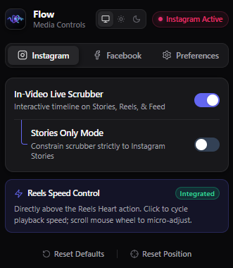
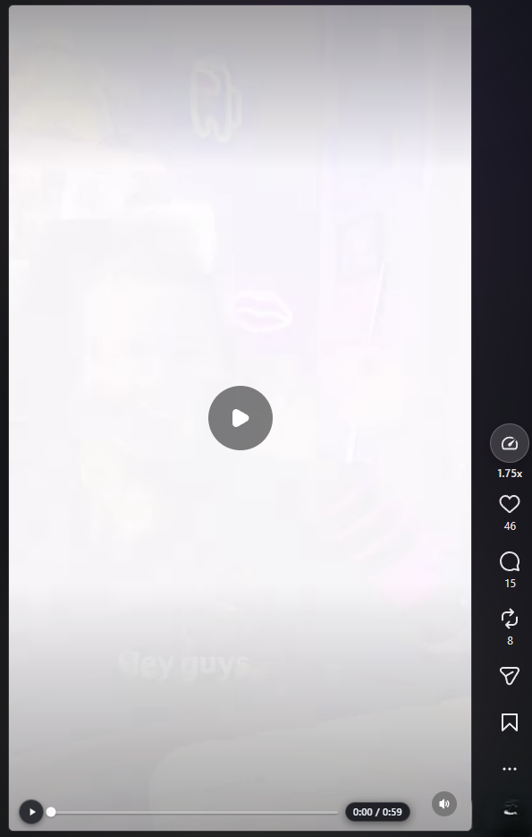
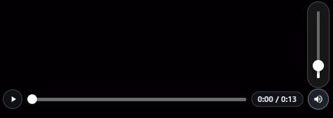
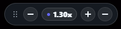

# Flow — Media Controls for Instagram & Facebook

<p align="center">
  
</p>

<p align="center">
  <strong>Precise timeline scrubbers, story audio controls, and playback tools for Instagram and Facebook.</strong>
</p>

<p align="center">
  <a href="https://github.com/Mohamed-Moslem-Allouch/flow-media-controls/releases"></a>
  <a href="https://developer.chrome.com/docs/extensions/mv3/"></a>
  <a href="LICENSE"></a>
  <a href="https://github.com/Mohamed-Moslem-Allouch/flow-media-controls"></a>
  <a href="https://github.com/Mohamed-Moslem-Allouch/flow-media-controls/pulls"></a>
</p>

<p align="center">
  <sub>Made with ❤️ and vibecoding by <strong>Mohamed Moslem Allouch</strong></sub>
</p>

---

## ⚡ Overview

**Flow** is a modern, lightweight, portfolio-grade browser extension engineered to enhance video playback across **Instagram** (Reels, Stories, Feed) and **Facebook** (Stories, Feed, Watch). 

Unlike legacy speed controllers, Flow integrates natively into social media interfaces with zero visual clutter, featuring an interactive in-video timeline scrubber, Instagram Reels speed cycling, Facebook Stories vertical sound capsule, and an adaptive theme architecture that matches platform dark and light appearances seamlessly.

---

## ✨ Features

- 🎞️ **Interactive In-Video Timeline Scrubber**:
  - Live progress track injected directly on Instagram Stories, Reels, Feed videos, and Facebook Stories.
  - Fluid click-to-seek and horizontal drag scrubbing.
  - Hover and drag time bubble with exact timestamp readouts (`0:14 / 0:45`).
  - Low-radiance, high-contrast player aesthetics that stay crisp on bright and dark video frames alike.
- ⚡ **Integrated Reels Speed Control**:
  - Native-styled button attached directly above the Heart icon in Instagram Reels (`/reels` and `/reel/...`).
  - Click to cycle speeds (`1.0x`, `1.25x`, `1.5x`, `1.75x`, `2.0x`); scroll mouse wheel to micro-adjust.
  - **100% Adaptive Appearance**: Dynamically detects Instagram Light ("White") and Dark modes with automatic high-contrast styling (`#18191a`).
- 🔊 **Facebook Stories Vertical Sound Capsule**:
  - Exact Instagram-matched vertical volume slider on Facebook Stories.
  - Hover reveals vertical slider; drag or scroll to adjust volume (0% – 100%).
  - Click speaker to instantly mute / unmute.
- 🎛️ **Floating Playback Controller (HUD)**:
  - Movable, tactile on-screen mini controller with custom drag grip.
  - Steppers (`−` / `+`), speed badge, and minimize-to-pill toggle.
  - Automatically remembers screen position across sessions.
- 🔒 **Meta Anti-Reset Playback Engine**:
  - Prevents Meta video players from resetting playback speed on buffering, resolution changes, or story transitions.
  - Automatically maintains pitch correction (`preservesPitch = true`).
- 🌓 **Comprehensive Design System & Theme Engine**:
  - 3-way theme selector (**Auto** / **Light** / **Dark**).
  - Dynamic `MutationObserver` monitors platform theme changes in real time.

---

## 📸 Screenshots & Demos

| Extension Dashboard | In-Video Scrubber | Reels Speed Control |
| :---: | :---: | :---: |
|  |   |  |
| *Segmented Controls & Themes* | *Interactive Timeline & Scrub* | *Adaptive Action Column Button* |

---

## 🚀 Installation

### Load Unpacked into Google Chrome / Chromium Browsers

1. Clone or download this repository:
   ```bash
   git clone https://github.com/Mohamed-Moslem-Allouch/flow-media-controls.git
   ```
2. Open Google Chrome and enter the extensions management URL:
   ```text
   chrome://extensions
   ```
3. Enable **Developer mode** via the toggle switch in the top-right corner.
4. Click the **Load unpacked** button in the top-left toolbar.
5. Select the repository root folder (`flow-media-controls/` where `manifest.json` is located).
6. Open [Instagram](https://www.instagram.com) or [Facebook](https://www.facebook.com) to enjoy enhanced playback controls!

---

## 💡 Usage Guide

### Instagram Reels (`/reels` and `/reel/...`)
- **Speed Control**: Look directly above the Heart (Like) button in the vertical action bar on the right.
  - Click the speed button to cycle between presets (`1.0x` → `1.25x` → `1.5x` → `1.75x` → `2.0x`).
  - Scroll your mouse wheel over the button for fine-grained speed adjustment (±0.25x).
- **Timeline Scrubber**: Hover over the bottom edge of any Reel video to reveal the scrub bar. Click or drag to seek to any point in the video.

### Instagram Stories (`/stories/*`)
- Hover over the story video to reveal the timeline scrubber and live duration badge.

### Facebook Stories
- Locate the circular sound capsule in the lower timeline row beside the timestamp.
- Hover over the speaker to expand the vertical volume slider; drag up or down to set audio levels.
- Click the speaker icon to toggle instant mute.

### Extension Popup
- Click the Flow icon in your browser toolbar to switch between **Instagram**, **Facebook**, and **Preferences** panels.
- Toggle features on or off individually according to your viewing preference.

---

## 📂 Project Structure

```text
flow-media-controls/
├── .editorconfig              # Consistent indentation and whitespace rules
├── .gitignore                 # Standard repository ignore definitions
├── CHANGELOG.md               # Version history and release notes
├── CONTRIBUTING.md            # Guidelines for issues and pull requests
├── LICENSE                    # MIT open-source license
├── README.md                  # Project documentation & overview
├── package.json               # Package metadata and lint scripts
├── manifest.json              # Chrome Manifest V3 configuration
├── background/
│   └── service-worker.js      # Background worker & storage initialization
├── content/
│   ├── core-speed-engine.js   # Anti-reset engine & adaptive theme detector
│   ├── facebook-features.js   # Facebook Stories vertical volume controller
│   ├── in-video-scrubber.js   # Timeline scrubber & drag-seek coordinator
│   ├── instagram-features.js  # Instagram Reels speed button & story modules
│   ├── movable-widget.js      # Floating on-screen HUD controller
│   ├── overlay.css            # Stylesheet & adaptive light/dark tokens
│   └── page-bridge.js         # Main execution context bridge
├── icons/
│   ├── icon-16.png            # 16×16 toolbar icon
│   ├── icon-48.png            # 48×48 extension details icon
│   └── icon-128.png           # 128×128 Chrome Web Store artwork
├── popup/
│   ├── popup.html             # Popup dashboard architecture
│   ├── popup.css              # Modern design system & tokenized styles
│   └── popup.js               # Extension settings and state persistence
└── docs/
    └── ARCHITECTURE.md        # Technical architecture & design audit notes
```

---

## 🛠️ Development & Testing

Run the syntax and code integrity check:
```bash
npm run lint
```

When making changes to content scripts or stylesheets, reload the extension at `chrome://extensions` and refresh the target social media tab (`F5`).

---

## 🤝 Contributing

Contributions, bug reports, and feature suggestions are welcome! Please check out [CONTRIBUTING.md](CONTRIBUTING.md) for guidelines on branch naming, code style, and submitting pull requests.

---

## 📄 License

This project is licensed under the **MIT License** — see the [LICENSE](LICENSE) file for details.

Copyright © 2025 **Mohamed Moslem Allouch**.

---

## 👤 Author

**Mohamed Moslem Allouch**
- GitHub: [@Mohamed-Moslem-Allouch](https://github.com/Mohamed-Moslem-Allouch)
- Project: [Flow — Media Controls](https://github.com/Mohamed-Moslem-Allouch/flow-media-controls)
- Built with: **vibecoding**

---

<p align="center">
  <sub>Made by Mohamed Moslem Allouch with vibecoding</sub>
</p>
